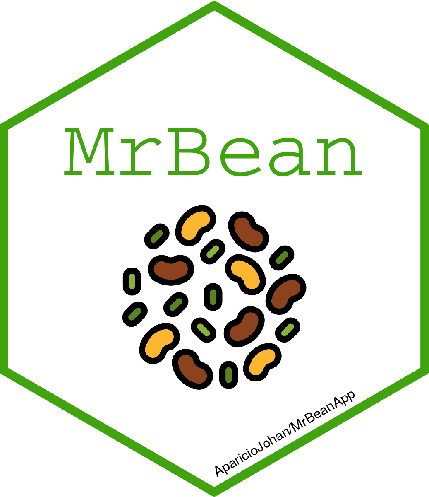
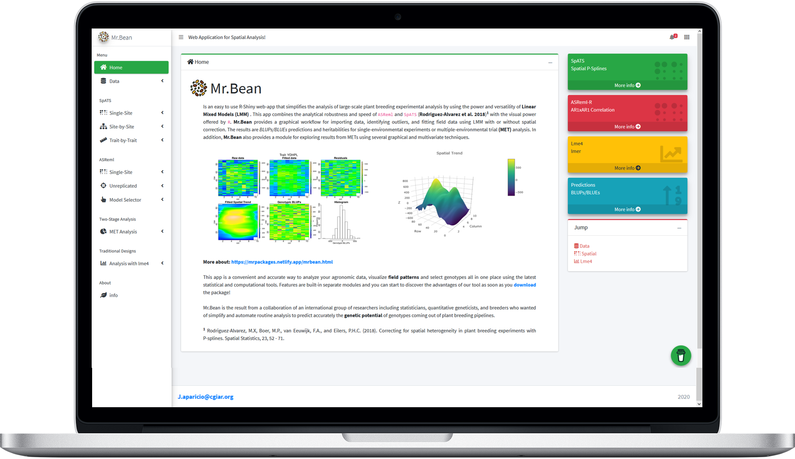

# MrBean 


[](https://www.tidyverse.org/lifecycle/#stable)


Mr. Bean is an easy to use R-Shiny web-app that simplifies the analysis of large-scale plant breeding experimental analysis by using the power and versatility of Linear Mixed Models (LMM). This app combines the analytical robustness and speed of ASReml and SpATS with the visual power offered by R.  Mr. Bean provides a graphical workflow for importing data, identifying outliers, and fitting field data using LMM with or without spatial correction. The results are BLUPs/BLUEs predictions and heritabilities for single-environmental experiments or multiple-environmental trial (MET) analysis. In addition, Mr. Bean also provides a module for exploring results from METs using several graphical and multivariate techniques.

<a href="https://apariciojohan.github.io/MrBeanApp/">https://apariciojohan.github.io/MrBeanApp/</a> 


## Installation

You can install the package:

``` r
devtools::install_github("AparicioJohan/MrBeanApp")                            
```
or

```r
remotes::install_github("AparicioJohan/MrBeanApp")                           
```


## Example

``` r
library(MrBean)
run_app()
```


## Demo

A running demo is on [shinyapps.io](https://beanteam.shinyapps.io/MrBean_BETA/).

<div class="row">
<div class="card">
<a href="https://beanteam.shinyapps.io/MrBean_BETA/" target="_blank"></a>
</div>
</div>

### Citation

> *Aparicio J, Gezan SA, Ariza-Suarez D, Raatz B, Diaz S, Heilman-Morales A and Lobaton J (2024)* Mr.Bean: a comprehensive statistical and visualization application for modeling agricultural field trials data. **Front. Plant Sci. 14:1290078.**; [https://doi.org/10.3389/fpls.2023.1290078](https://doi.org/10.3389/fpls.2023.1290078)

### Acknowledgments

* [Bean Breeding Program - International Center for Tropical Agriculture (CIAT)](https://alliancebioversityciat.org/)
* [Big Data Pipeline Unit (NDSU)](https://sites.google.com/ndsu.edu/plsc-bpdm/home)
  * Ana Maria Heilman
  * Didier Murillo Florez

## Code of Conduct

Please note that the ‘MrBean’ project is released with a [Contributor
Code of Conduct](CODE_OF_CONDUCT.md). By contributing to this project,
you agree to abide by its terms.
